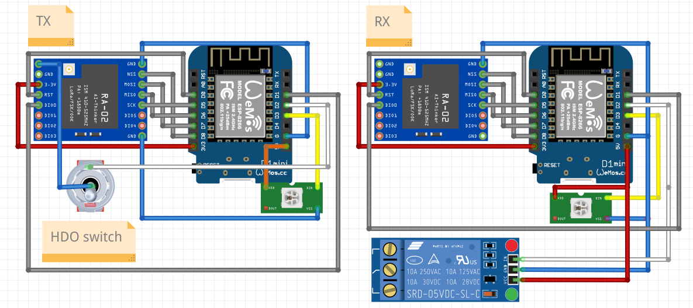

Remote HDO (relay) toggle, working code for arduino.

**Needed hardware:**
- Ai-Thinker RA-02 SX1278 433MHz (or some other LoRa module)
- Arduino running on 3v3 (some d1 mini, esp 32 dev board, pro micro)
- Relay module
- 433Mhz antena and pigtal to SMA Female cable reduction

Image:


**Optional hw:**
- NeoPixel WS2812 RGB led to indicate two-way communication


Compile, upload and monitor with Platformio using make:
```bash
make tx
make rx
```

**Casing**

Transiever can barely fit into [this DIN rail casing](https://www.printables.com/model/405333-esp-wemos-d1-mini-and-rs485-ttl-adapter-mounting-c)

For receiver i just printed simple box and made messy holes with soldering iron.
